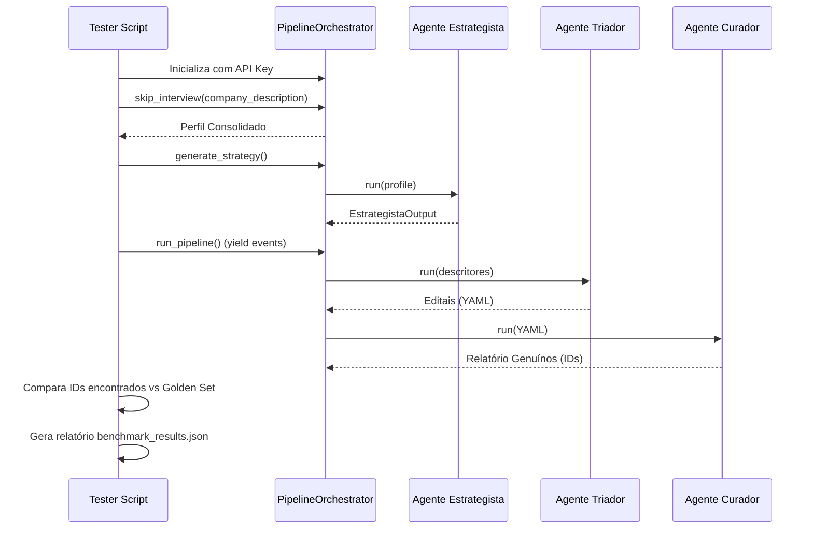

# Especificação Técnica: Motor de Regressão do Pipeline

## Objetivo
Desenvolver um script capaz de executar o pipeline de agentes de forma controlada e mensurável, comparando a saída contra uma lista de IDs esperados (Golden Set).

## Arquitetura de Teste



## Estrutura do Script (Pseudocódigo)

```python
# scripts/run_regression.py

async def main():
    # 1. Carregar Caso de Teste
    case = load_json("core/tests/regression/cases/tv_cabo_rj.json")
    
    # 2. Configurar Orquestrador (Sandbox Mode)
    orch = PipelineOrchestrator(llm_client)
    
    # 3. Forçar Perfil
    await orch.skip_interview(case.company_description)
    
    # 4. Gerar Estratégia e capturar descritores
    strategy_result = await orch.generate_strategy()
    print(f"Descritores: {strategy_result.descritores_principais}")
    
    # 5. Executar Pipeline Real
    found_ids = []
    async for event in orch.run_pipeline():
        if event.type == "curador_complete":
            # Extrair IDs do relatório gerado
            found_ids = extract_ids_from_report(event.report_path)
            
    # 6. Calcular Métricas
    hits = [id for id in case.expected_ids if id in found_ids]
    misses = [id for id in case.expected_ids if id not in found_ids]
    
    # 7. Relatório
    report = {
        "precision": len(hits) / total_found if total_found > 0 else 0,
        "recall": len(hits) / len(case.expected_ids),
        "misses": [{"id": id, "stage": detect_failure_stage(id)} for id in misses]
    }
    save_report(report)
```

## Critérios de Sucesso
- O script deve detectar se uma oportunidade foi perdida no **Estrategista** (não gerou termo), no **Triador** (não baixou) ou no **Curador** (reprovou).
- Deve ser independente da interface Web (CLI friendly).
- Deve usar o `GeminiClient` real para garantir que los resultados reflitam a produção.
