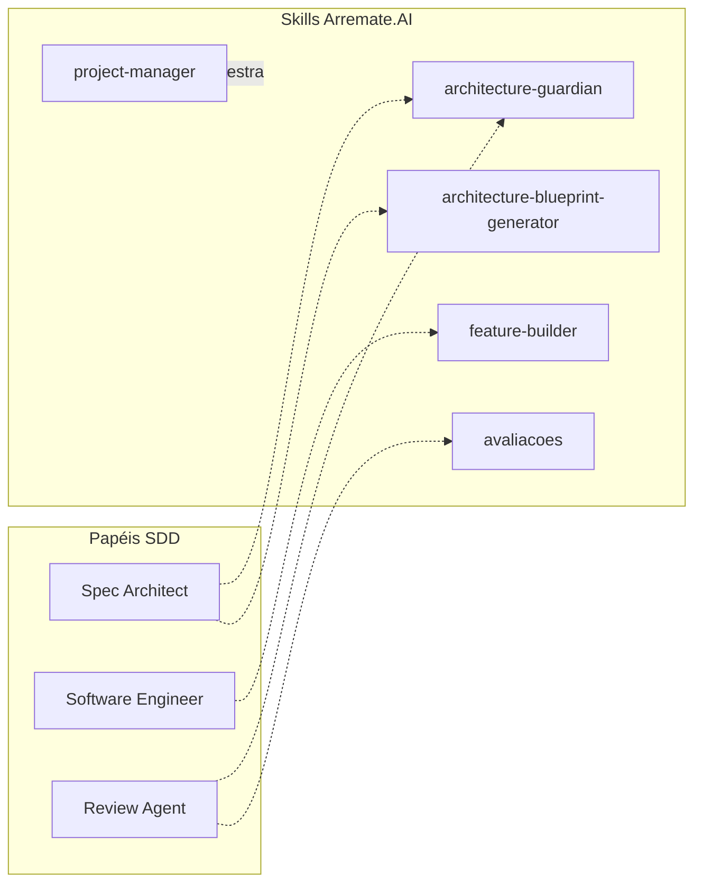

# Comparativo Técnico: Spec Driven Development vs. Pipeline Maestro (Arremate.AI)

Esta análise técnica compara a metodologia de **Spec Driven Development (SDD)**, baseada na centralização de especificações em arquivos Markdown para orientação de LLMs, com o sistema de **Orquestração Multi-Agente (Pipeline Maestro)** atualmente em uso no projeto Arremate.AI.

## 1. Visão Geral das Abordagens

| Característica | Spec Driven Development (SDD) | Pipeline Maestro (Arremate.AI) |
| :--- | :--- | :--- |
| **Ponto Central** | Arquivos de Especificação (`/specs`) | Plano de Ação (`PLAN.md`) e Tarefas (`TASKS.md`) |
| **Filosofia** | Declarativa (O "Quê", não o "Como") | Orquestrada (Gestão de Squads e Locks) |
| **Loop de Dev** | Spec -> Code -> Review -> (Regen via Spec) | Maestro -> Plan -> Approve -> Build -> Test |
| **Escalabilidade** | Focada em features isoladas | Focada em sistemas complexos e paralelos |
| **Mecanismo** | Agents condicionados por `AGENTS.md` | Skills especializadas com protocolos de lock |

---

## 2. Mapeamento de Papéis (Mapping)

Podemos observar que o ecossistema do Arremate.AI já incorpora e expande os conceitos de SDD:

- **Spec Architect**: No Arremate, isso é dividido entre o `architecture-blueprint-generator` (criação) e o `architecture-guardian` (auditoria).
- **Software Engineer**: Corresponde diretamente ao `feature-builder`.
- **Review Agent**: Corresponde a `avaliacoes` e `architecture-guardian`, com suporte do `pipeline-tester`.

---

## 3. Pontos de Sinergia e Melhoria (O Portfólio Arremate.AI+)

O Pipeline Maestro é um **super-conjunto** do SDD. No entanto, o SDD traz uma disciplina rigorosa que pode ser melhor integrada ao nosso workflow:

### A. O Lustro da Especificação ("The Specs folder")
No SDD, o código manual é desencorajado. No Arremate.AI, temos uma abordagem híbrida. 
**Proposta:** Fortalecer o uso do `PLAN.md` como a "Single Source of Truth", onde o `architecture-guardian` bloqueia qualquer `feature-builder` que tente implementar algo não explicitado no `PLAN.md` ou em um ticket de especificação técnica.

### B. Manutenibilidade via Specs vs. Refatoração Manual
O SDD propõe que, para mudar o código, mude o Markdown. 
**Como o Arremate.AI ganha:** O `feature-builder` pode atuar em modo "Refactor-from-Spec", onde ele lê o `PLAN.md` e os arquivos de arquitetura antes de tocar em qualquer linha de código, garantindo que o "How" nunca desvie do "What".

---

## 4. Análise Crítica (Chain of Thought - 3 Cenários)

Ao considerar a adoção estrita do SDD no pipeline atual:

1. **Cenário "O Mais Rápido":** Manter o Maestro como está, usando prompts diretos.
   - *Prós:* Velocidade de implementação imediata.
   - *Contras:* Risco de "Vibe Coding" (agente inventando lógica fora do core).

2. **Cenário "O Mais Seguro":** Integrar o SDD como um "Gate" obrigatório.
   - *Prós:* Erro zero de arquitetura. O código é apenas um subproduto da Spec.
   - *Contras:* Overhead inicial em documentar cada pequena mudança.

3. **Cenário "O Mais Escalável" (RECOMENDADO):** Pipeline Maestro Orquestrando a SDD.
   - O Maestro delega ao `architecture-blueprint-generator` a escrita da Spec técnica antes do `feature-builder` começar.
   - O `architecture-guardian` valida se a Spec respeita o `PLAN.md`.
   - O `feature-builder` implementa baseando-se estritamente na Spec gerada.

---

## 5. Próximos Passos (TASKS.md Update)

1. [ ] Definir padrão de "Spec Técnica" dentro da Skill `architecture-blueprint-generator`.
2. [ ] Configurar o `feature-builder` para aguardar o status `SPEC_APPROVED` no `registro_atividades.json`.
3. [ ] Atualizar o protocolo do `architecture-guardian` para auditar código vs spec, não apenas código vs regras gerais.

---
**Conclusão:** O Pipeline Maestro é a infraestrutura de guerra; o Spec Driven Development é a doutrina de combate. Combiná-los torna o Arremate.AI imbatível em termos de integridade técnica.
